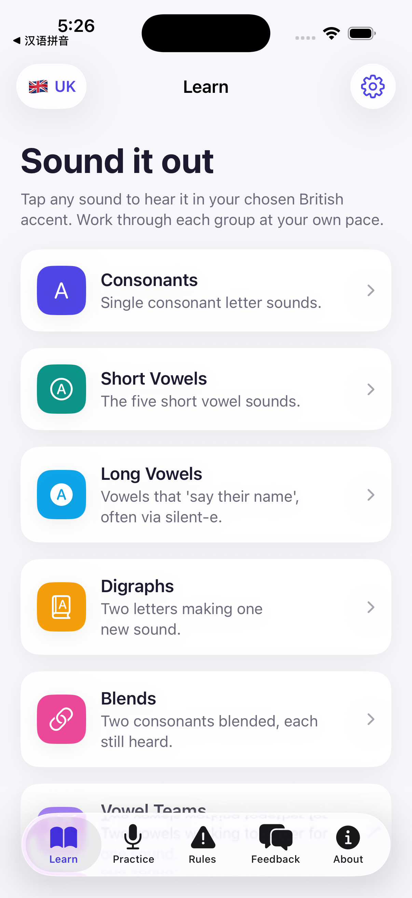

# Phonics — Pronunciation Trainer for Adults

A native iOS (SwiftUI) app that helps adults learn English **pronunciation and phonics**.
Tap any sound, word, rule, or sentence to hear it spoken with on-device voice-over in a
**British** or **American** accent — fully offline.



## Features

- **Learn** — the full phonics curriculum: consonants, short & long vowels, digraphs, blends,
  vowel teams, diphthongs, r-controlled vowels, and soft c/g. Every phoneme has IPA, a
  plain-language articulation cue, example words, and one-tap voice-over.
- **Practice** — graded speaking sessions:
  - **Intonation & Emotion** — hear one sentence spoken happy, sad, angry, excited, as a
    question, and more. Pitch, pace, and stress are reshaped per emotion so learners hear how
    intonation carries meaning.
  - **Minimal pairs** (ship/sheep), **tongue twisters**, **short everyday messages**, and
    **sentence drills**.
- **Rules** — the exception/irregular spellings phonics can't predict: silent letters, the many
  sounds of *ough*, soft c/g, *i-before-e*, tricky sight words, the schwa, and doubling/drop-e.
- **Accent picker** — switch between 🇬🇧 British (en-GB) and 🇺🇸 American (en-US) anywhere; the
  choice is persisted.
- **Feedback** — send a note straight to the team via WhatsApp.
- **About** — app info, developer, learning reference, and version.

## Voice-over

Speech uses Apple's on-device `AVSpeechSynthesizer`, which ships genuine **en-GB** and **en-US**
voices — so accent selection is real and works without a network. Emotion presets map onto the
utterance's `rate`, `pitchMultiplier`, `volume`, and delay.

> A future version can swap the engine for [Kyutai Pocket-TTS](https://kyutai.org/pocket-tts-technical-report)
> behind the same `SpeechManager.speak(...)` interface without touching any view.

## Project structure

```
Sources/
  PhonicsApp.swift          App entry
  Theme.swift               Brand tokens + card modifier
  Models/                   Phoneme, ExceptionRule, Emotion, PracticeContent, ContentLibrary
  Services/                 SpeechManager (AVSpeechSynthesizer), AppSettings (@AppStorage)
  Views/                    Learn, Practice, Rules, Emotion, Feedback, About, Settings, Components
Resources/
  Assets.xcassets           App icon + accent color
project.yml                 XcodeGen project definition
```

## Build & run

```bash
brew install xcodegen          # if not installed
xcodegen generate              # creates Phonics.xcodeproj
open Phonics.xcodeproj         # ⌘R to run, or:
xcodebuild -project Phonics.xcodeproj -scheme Phonics \
  -destination 'platform=iOS Simulator,name=iPhone 17 Pro Max' build
```

- **Min iOS:** 17.0 · **Devices:** iPhone & iPad · **Frameworks:** SwiftUI, AVFoundation

## Reference

Curriculum structure follows standard synthetic-phonics practice — see
[Phonics (Wikipedia)](https://en.wikipedia.org/wiki/Phonics).

## Developer

[Tertiary Infotech Academy Pte Ltd](https://www.tertiaryinfotech.com)
