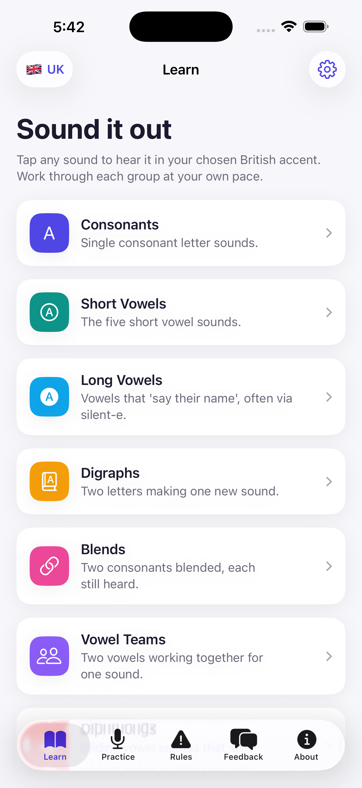

# Phonics — Pronunciation Trainer for Adults

A native iOS (SwiftUI) app that helps adults learn English **pronunciation and phonics**.
Tap any sound, word, rule, or sentence to hear it spoken in a **British** or **American**
accent — fully offline.

> 🎉 **Now live on the App Store!**
> [**Phonics Pronunciation Coach**](https://apps.apple.com/us/app/phonics-pronunciation-coach/id6782569616)

<a href="https://apps.apple.com/us/app/phonics-pronunciation-coach/id6782569616">
  
</a>



## Features

- **Learn** — the full phonics curriculum: consonants, short & long vowels, digraphs, blends,
  vowel teams, diphthongs, r-controlled vowels, and soft c/g. Every phoneme has IPA, a
  plain-language articulation cue, example words, and one-tap voice-over.
- **Practice** — graded speaking sessions:
  - **Intonation & Emotion** — hear one sentence spoken happy, sad, angry, excited, as a
    question, and more. Pitch, pace, and stress are reshaped per emotion so learners hear how
    intonation carries meaning.
  - **Minimal pairs** (ship/sheep), **tongue twisters**, **short everyday messages**, and
    **sentence drills**.
- **Rules** — the exception/irregular spellings phonics can't predict: silent letters, the many
  sounds of *ough*, soft c/g, *i-before-e*, tricky sight words, the schwa, and doubling/drop-e.
- **Accent + voice** — switch between 🇬🇧 British (en-GB) and 🇺🇸 American (en-US) anywhere, and
  pick a **female or male** voice in Settings; choices are persisted.
- **Feedback** — send a note straight to the team via WhatsApp.
- **About** — app info, developer, learning reference, audio attribution, and version.

## Voice-over

- **Words** — example words, minimal pairs, and rule examples play **real human recordings**
  sourced from Wiktionary / Wikimedia Commons (CC BY-SA), bundled for offline use, with an
  Apple TTS fallback for any word without a recording.
- **Phoneme sounds** — "Hear the sound" demonstrates a phoneme via `AVSpeechSynthesizer` fed a
  hidden pseudo-word cue tuned per sound (e.g. /iː/ → "ee", /eɪ/ → "ai") so the engine produces
  the isolated sound as closely as it can.
- **Intonation & Emotion** — emotion presets reshape the utterance's `rate`, `pitchMultiplier`,
  `volume`, delay, and punctuation so the synthesizer applies real rising/falling prosody.

Audio attribution is shown in the in-app **About** tab as required by the CC BY-SA license.

## Project structure

```
Sources/
  PhonicsApp.swift          App entry
  Theme.swift               Brand tokens + card modifier
  Models/                   Phoneme, ExceptionRule, Emotion, PracticeContent, ContentLibrary
  Services/                 SpeechManager (AVSpeechSynthesizer), AppSettings (@AppStorage)
  Views/                    Learn, Practice, Rules, Emotion, Feedback, About, Settings, Components
Resources/
  Assets.xcassets           App icon + accent color
project.yml                 XcodeGen project definition
```

## Build & run

```bash
brew install xcodegen          # if not installed
xcodegen generate              # creates Phonics.xcodeproj
open Phonics.xcodeproj         # ⌘R to run, or:
xcodebuild -project Phonics.xcodeproj -scheme Phonics \
  -destination 'platform=iOS Simulator,name=iPhone 17 Pro Max' build
```

- **Min iOS:** 17.0 · **Devices:** iPhone & iPad · **Frameworks:** SwiftUI, AVFoundation
- **App Store:** [id6782569616](https://apps.apple.com/us/app/phonics-pronunciation-coach/id6782569616) — live

## Reference

Curriculum structure follows standard synthetic-phonics practice — see
[Phonics (Wikipedia)](https://en.wikipedia.org/wiki/Phonics).

## Developer

[Tertiary Infotech Academy Pte Ltd](https://www.tertiaryinfotech.com)
